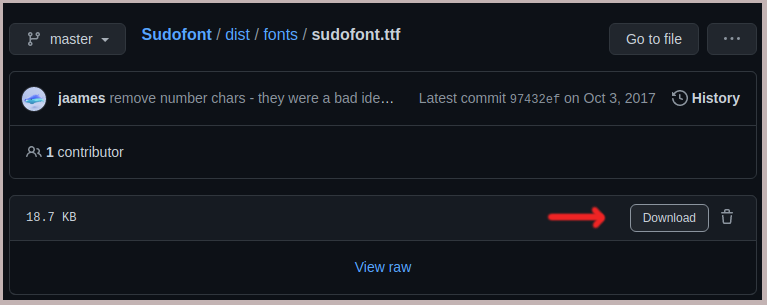

# Flipnote ID

Flipnote ID is a program written in Python 3 that can get the names, Studio IDs, thumbnails, and more from the metadata of Flipnotes. It works with both PPM files (Flipnote Studio / DSi) and KWZ files (Flipnote Studio 3D / 3DS). Output can either be printed through the terminal or to simple HTML files.

## Download

This program requires [Python 3](https://www.python.org/downloads/) to run. Optionally, [Sudofont](https://github.com/Sudomemo/Sudofont) can be used to correct issues with missing characters in the HTML files.

If Python 3 is not already installed on the system, that should be done first. On Linux, this script was tested and developed with Python 3.6.9, but it should work with any version of Python 3. For Windows, Python 3.7 or higher is required.

Next, clone this repository.
```sh
git clone https://github.com/pummelator/flipnote-id
```
Alternatively, this repo can be downloaded as a ZIP using Github's "Download ZIP" option. Make sure to unpack the ZIP somewhere it can be easily found before continuing on.

Once that's completed, the program can be used. However, to get Sudofont to work, a copy of the TTF version of the font will need to be downloaded to the same directory as the main Flipnote ID files. From the command line, this can be done using `wget`
```sh
cd flipnote-id
wget https://raw.githubusercontent.com/Sudomemo/Sudofont/master/dist/fonts/sudofont.ttf
```

This can also be done by going to [this page](https://github.com/Sudomemo/Sudofont/blob/master/dist/fonts/sudofont.ttf) and clicking the download button.


## Usage

To use Flipnote ID, open a terminal in the FlipnoteID directory. This assumes that Python has been configured to be in the system's PATH, so just typing "python3" (or potentially just "python") will run the Python executable. The examples shown below will all use "python3" to run the appropriate version of Python, but that may not be the case on all systems.

The general usage for this program looks like this on Linux/macOS:
```sh
python3 flipnote_id.py IN_PATH OPTIONS
```
and this on Windows:
```sh
python3 -Xutf8 flipnote_id.py IN_PATH OPTIONS
```
The `-Xutf8` option is necessary on Windows to ensure that the character encoding used is UTF-8. The program won't work without it.
- IN_PATH specifies the input file or directory and must be given in order for the program to run.
- OPTIONS can be any of the additional options that are available. These can be given in any order. If a file is specified, then output will be directed to the terminal and any other options specified will be ignored, as they mostly pertain to directory outputs. For a list of options, check the [documentation directory](https://github.com/pummelator/flipnote-id/blob/main/doc/options.md) for a file detailing the options or run
```sh
python3 flipnote_id.py -h
```

Example of using Python ID on a single file:
```sh
python3 flipnote_id.py "Documents/Flipnotes/John/my_cool_flipnote.ppm"
```
(The specified filename isn't in the format of an actual PPM filename, it's just an example)

Example of using Python ID on a directory and sending the HTML output files to the "Documents/" directory:
```sh
python3 flipnote_id.py "Documents/Flipnotes/" -o="Documents/"
```
The HTML files, thumbnails (unless told not to get them), and sudofont.ttf, (if downloaded and placed in the right spot) will be in a directory called "flipnoteid_out/". If no output directory is specified, this will be placed in the same directory as the input path.

## Credits

- Credits to the [Flipnote Collective](https://github.com/Flipnote-Collective) for their documentation of the [PPM](https://github.com/Flipnote-Collective/flipnote-studio-docs) and [KWZ](https://github.com/Flipnote-Collective/flipnote-studio-3d-docs) file formats. I also used some code listed in their PPM documentation for determining the checksum character in filenames (as listed on [this page](https://github.com/Flipnote-Collective/flipnote-studio-docs/wiki/FSIDs-and-Filenames#filesystem-filenames)) and the pseudocode detailing how to process PPM thumbnails (as listed on [this page](https://github.com/Flipnote-Collective/flipnote-studio-docs/wiki/PPM-format#thumbnail-images)). While code from it wasn't used here, the [flipnote-fetcher](https://github.com/Flipnote-Collective/flipnote-fetcher) script inspired me to make this, as Flipnote Studio IDs are the only way to check for a user's Flipnotes in the Internet Archive's partial backup of the DSi Library from Flipnote Gallery World.

- Credits to [pbsds](https://github.com/pbsds/) for additional documentation on [the PPM format](https://github.com/pbsds/hatena-server/wiki/PPM-format)

- Credits to the [Sudomemo](https://www.sudomemo.net/) team for [Sudofont](https://github.com/Sudomemo/Sudofont) and for hosting one of the most well-established modern alternatives to Flipnote Hatena.

## License

This code is under an MIT license. For more information, please read the LICENSE file.
